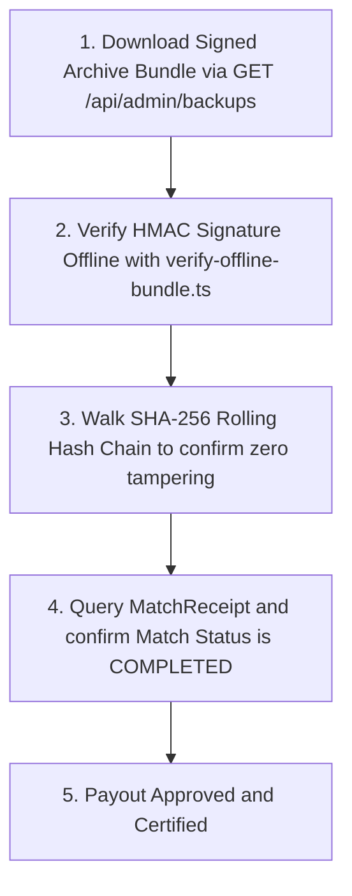

# RCADE Arena: Tournament Readiness Manual

This manual defines the deterministic competitive protocols, normalization rules, and validation specs required to run certification-grade tournaments on the RCADE Arena. 

---

## 📐 Deterministic Coordinates & Time Quantization

To guarantee identical gameplay evaluations across various client devices, geographical locations, and mobile internet latencies, RCADE enforces absolute **coordinate quantization and timestamp grids**.

### 1. Timestamp Grid Quantization
* Raw client-side timestamp floats are **quantized into 10ms grids** before verifier hashing.
* This absorbs packet delays and microsecond frame variances:
  ```typescript
  const quantizedTimestamp = Math.round(rawTimestamp / 10) * 10;
  ```

### 2. Coordinate Quantization (Neon Snake Grid)
* Physics floats represent discrete grid coordinates. For Neon Snake, body elements are quantized to standard discrete tile grids (integers representing columns and rows):
  ```typescript
  const quantizedX = Math.round(rawCoordinateX);
  const quantizedY = Math.round(rawCoordinateY);
  ```
* Direct float comparisons are strictly prohibited to protect the verifier from floating-point rounding mismatches across browser engines (V8 vs WebKit).

---

## 🔠 Canonical Key Alphabetical Serialization

To secure evidence receipts against signature mismatches, all JSON objects must follow strict **alphabetical serialization rules** before computing SHA-256 telemetry hashes or HMAC-SHA256 settlement signatures.

### 1. The Serialization Rule
* Keys of all JSON objects must be sorted alphabetically in recursive depth-first order.
* Array objects remain in original sequence order.
* `CompatibilityDecoder.canonicalizeJson(payload)` must be used consistently across all clients, verifiers, and offline verify CLIs:
  ```typescript
  static canonicalizeJson(obj: any): string {
    if (obj === null) return 'null';
    if (typeof obj !== 'object') return JSON.stringify(obj);
    if (Array.isArray(obj)) {
      return '[' + obj.map(item => this.canonicalizeJson(item)).join(',') + ']';
    }
    const sortedKeys = Object.keys(obj).sort();
    const keyValPairs = sortedKeys.map(key => {
      return `"${key}":${this.canonicalizeJson(obj[key])}`;
    });
    return '{' + keyValPairs.join(',') + '}';
  }
  ```

---

## 🛡️ Referee & Auditor Checklist

Before distributing tournament payouts, escrows, or seasonal ranked prizes, referees must execute the following mathematical verification checklist:



### Protocol Steps:
1. **Download Evidence Bundle**:
   - Access GET `/api/admin/backups?secret=[ADMIN_SECRET_KEY]` to download the signed backup file.
2. **Execute Offline CLI Verification**:
   - Run the verify script:
     ```powershell
     npx ts-node --project tsconfig.json scripts/verify-offline-bundle.ts --file=./rcade-audit-snapshot.json
     ```
3. **Verify Integrity Logs**:
   - Confirm the CLI prints `🛡️ VERIFICATION SUCCESS: EXPORTS ARE GENUINE`.
4. **Assert Settlement Boundaries**:
   - Verify that player scores in the offline receipt perfectly match the in-game bracket reports.
5. **Certify Tournament Outcome**:
   - Archive the verified bundle locally as immutable proof of competitive integrity for tournament records.
